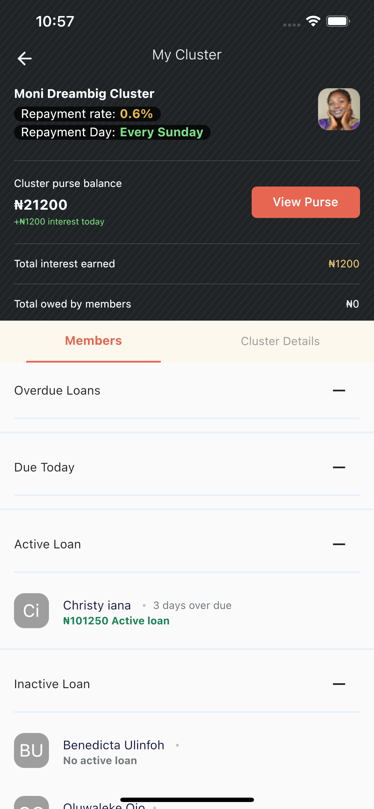

# Flutter Mobile Engineer Task

Moni task UI and API integration for Flutter Mobile Engineer position.

## Screenshots

## Brief Description

The "My Cluster" screen's UI and API implementation. The details of a cluster are displayed on this page. There are two tabviews in it (members and cluster details). The "Members" tabview displays a list of cluster members as well as their loan status, whereas the "Cluster Details" tabview displays cluster details.

Uses MVVM architecture

## APK DOWNLOAD
[Download](https://github.com/cyiboy/moni_africa/blob/main/flutter-apk/app-release.apk)

## Fonts
- DMSans
- Inter

## Packages
- get
- http
- flutter_svg

## Design parten
[getx_pattern](https://github.com/kauemurakami/getx_pattern)
 

